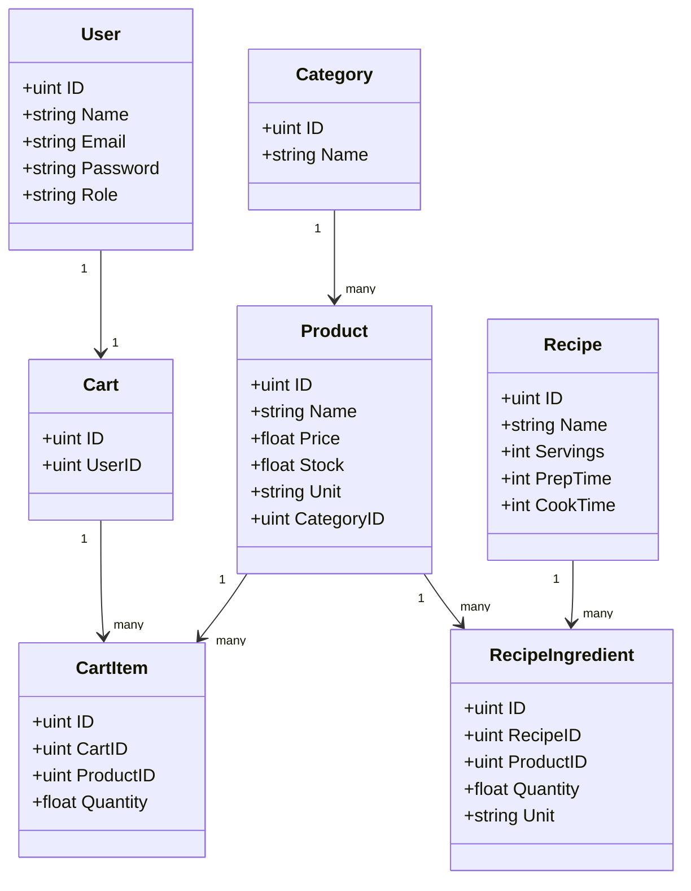
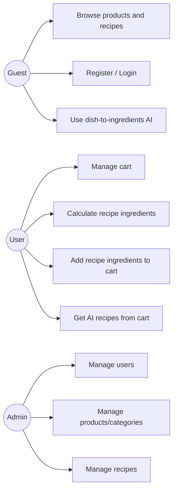
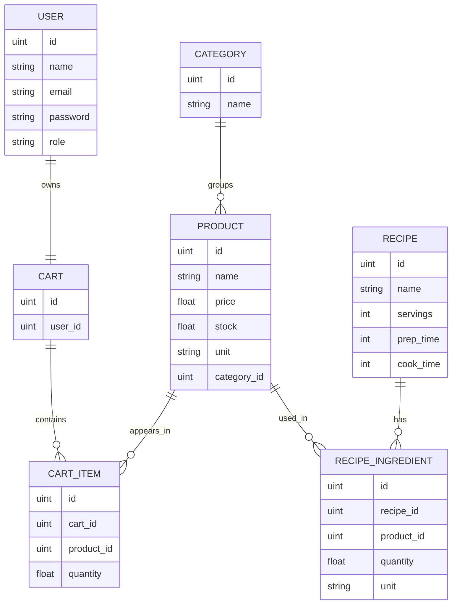

# Project Documentation - Smart Food Store

## Architecture & Decisions
- **Backend architecture:** Go + Gin + GORM, organized by layers: `handlers -> services -> repository -> database/models`.
- **Frontend architecture:** React + Vite SPA with route guards and centralized client state (`zustand`).
- **Authentication:** JWT (HS256), `Authorization: Bearer <token>`.
- **Authorization:** Role-based access (`user`, `admin`) via middleware.
- **Database:** PostgreSQL with GORM auto-migrations and startup seed data.
- **AI integration:** Gemini REST API for ingredient and recipe suggestions using store inventory.
- **API response style:** Success returns domain JSON objects; errors return `{ "error": "..." }` with HTTP status codes.

## Data Models (GORM/JSON)
Source files: `internal/models/user.go`, `internal/models/product.go`, `internal/models/cart.go`, `internal/models/recipe.go`

### User
- `email` unique (`uniqueIndex`)
- `password` hashed with bcrypt
- `role` in `{user, admin}`
- One-to-one relation with `cart`

### Category
- `name` unique and required
- One-to-many relation with `products`

### Product
- Required: `name`, `price`, `unit`, `category_id`
- Validation at request level:
  - `price > 0`
  - `stock >= 0`
- Belongs to category; used in cart and recipe ingredients

### Cart / CartItem
- One cart per user (`user_id` unique on cart)
- Cart item: `product_id` + `quantity`
- Quantity must be `> 0` for add; update with `<= 0` removes item

### Recipe / RecipeIngredient
- Recipe contains metadata (`servings`, `prep_time`, `cook_time`, instructions)
- Ingredients link recipes to products with `quantity`, `unit`, `notes`
- Supports serving-based quantity scaling

## Core Endpoints (Examples)

### Health
- `GET /api/v1/health`

### Auth
- `POST /api/v1/auth/register`
```json
{
  "name": "Alice",
  "email": "alice@example.com",
  "password": "password123"
}
```
- `POST /api/v1/auth/login`
```json
{
  "email": "alice@example.com",
  "password": "password123"
}
```

### Products & Categories (Public)
- `GET /api/v1/products`
- `GET /api/v1/products/:id`
- `GET /api/v1/products/category/:category_id`
- `GET /api/v1/products/search?q=tomato`
- `GET /api/v1/categories`

### Recipes
- `GET /api/v1/recipes`
- `GET /api/v1/recipes/:id`
- `GET /api/v1/recipes/search?q=soup`
- `GET /api/v1/recipes/:id/calculate?servings=4`
- `POST /api/v1/recipes/:id/add-to-cart` (JWT required)
```json
{
  "servings": 4
}
```

### Cart (JWT required)
- `GET /api/v1/cart`
- `POST /api/v1/cart/items`
```json
{
  "product_id": 3,
  "quantity": 2
}
```
- `POST /api/v1/cart/items/bulk`
- `PUT /api/v1/cart/items/:product_id`
- `DELETE /api/v1/cart/items/:product_id`
- `DELETE /api/v1/cart`

### AI
- `POST /api/v1/ai/dish-to-ingredients`
```json
{
  "dish_name": "Pasta Carbonara",
  "servings": 2
}
```
- `POST /api/v1/ai/products-to-recipes`
```json
{
  "product_ids": [1, 4, 7]
}
```
- `GET /api/v1/ai/cart-to-recipes` (JWT required)
- `POST /api/v1/ai/add-to-cart` (JWT required)

### Admin (JWT + admin role)
- Users:
  - `GET /api/v1/admin/users`
  - `GET /api/v1/admin/users/:id`
  - `PATCH /api/v1/admin/users/:id/role`
  - `DELETE /api/v1/admin/users/:id`
- Products:
  - `POST /api/v1/admin/products`
  - `PUT /api/v1/admin/products/:id`
  - `DELETE /api/v1/admin/products/:id`
- Categories:
  - `POST /api/v1/admin/categories`
  - `PUT /api/v1/admin/categories/:id`
  - `DELETE /api/v1/admin/categories/:id`
- Recipes:
  - `POST /api/v1/admin/recipes`
  - `PUT /api/v1/admin/recipes/:id`
  - `DELETE /api/v1/admin/recipes/:id`

## UML (Class Diagram)


## Use-Case Diagram


## ERD


## Business Rules
- User registration creates a cart automatically.
- Cart add/update operations validate available product stock.
- Bulk cart add silently skips invalid products and caps quantity by stock.
- Recipe scaling uses ratio: `requested_servings / base_servings`.
- Add-recipe-to-cart and AI add-to-cart include only available ingredients.
- Admin endpoints require both valid JWT and `admin` role.
- AI endpoints require `GEMINI_API_KEY`; otherwise request fails with a clear error.
- Soft delete is enabled for main entities via `gorm.DeletedAt`.
