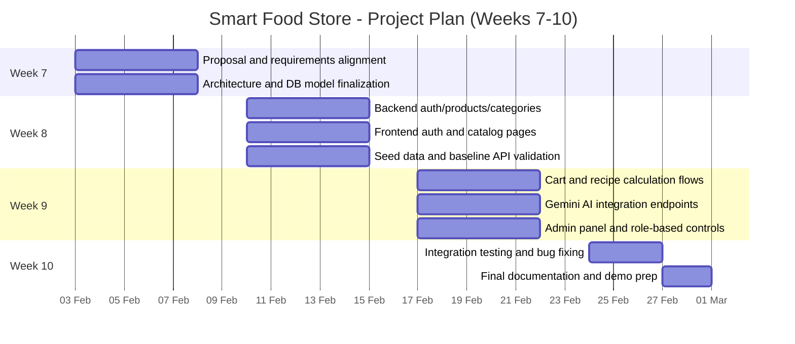

# Project Plan (Weeks 7-10)

## Responsibilities
- **Tukezhan Kausar:** Backend domain logic (auth, products, recipes, admin APIs), DB schema consistency.
- **Ginayat Yerassyl:** Frontend routes/pages, API integration, UX flows for catalog, cart, and recipes.
- **Behruz Tokhtamishov:** AI module (Gemini prompts and parsing), integration tests, final technical documentation.
